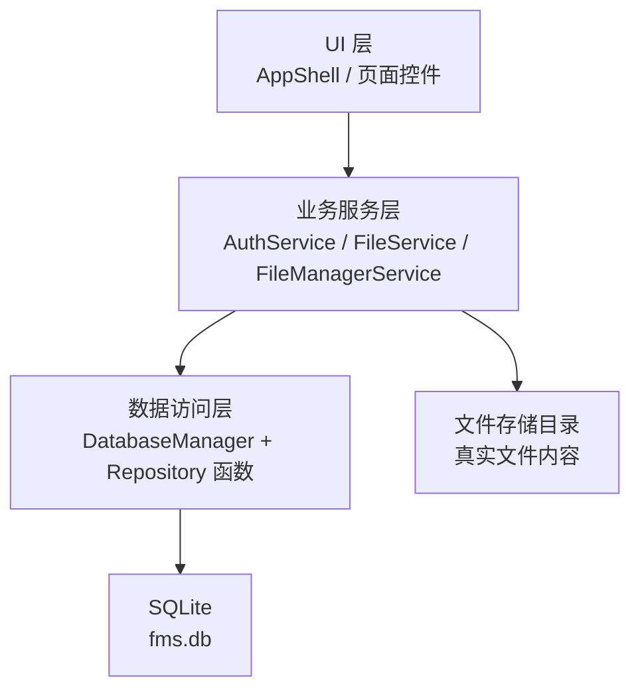
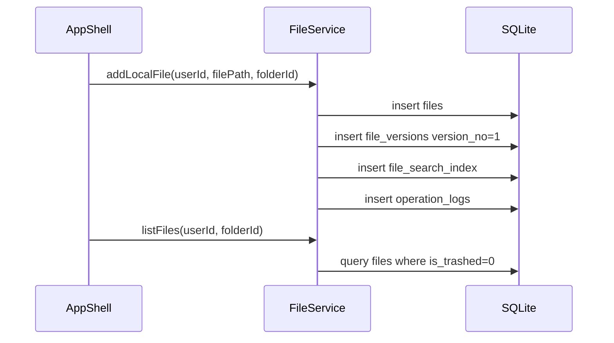

# FMS 文件管理系统开发规划文档

## 1. 项目目标

FMS 是一个面向多用户的桌面文件管理系统。项目最终目标不是只做一个“本地文件列表”，而是实现一套可扩展的文件管理平台：用户可以登录系统，管理自己的文件和文件夹，对文件进行分类、标签、搜索、版本管理、权限分享和备份恢复。

后续开发应围绕三个核心能力推进：

- 文件资产管理：上传、添加、删除、恢复、分类、标签、搜索、版本记录。
- 多用户协作：账号、角色、权限、分享链接、文件锁定、操作日志。
- 数据安全与可维护：SQLite 持久化、软删除、备份任务、数据库结构统一维护。

## 2. 目标功能总览

| 功能方向 | 目标能力 |
| --- | --- |
| 用户系统 | 注册、登录、角色分配、用户状态管理 |
| 文件管理 | 添加文件、文件夹管理、删除恢复、移动重命名 |
| 文件版本 | 每次覆盖上传生成新版本，可查看历史版本 |
| 大文件支持 | 文件分片记录、分片校验、断点续传预留 |
| 分类标签 | 一个文件一个分类，一个文件多个标签 |
| 搜索过滤 | 按名称、类型、标签、分类、摘要搜索 |
| 权限控制 | 文件/文件夹授权给其他用户，只读、可写、管理员权限 |
| 分享链接 | 生成分享 token，可设置密码、过期时间和访问次数 |
| 协作编辑 | 文件锁定，避免多人同时修改同一文件 |
| 日志审计 | 记录登录、上传、删除、分享、授权、恢复等操作 |
| 备份恢复 | 记录备份任务状态，为后续自动备份功能做准备 |
| 多媒体摘要 | 保存图片、音频、视频、文档的摘要元数据 |

## 3. 推荐开发分层



### UI 层目标

UI 层只负责展示和用户交互，不直接拼 SQL。

后续建议页面：

- 首页：最近文件、文件列表、添加文件、搜索框。
- 文件夹页：树形目录、当前目录文件。
- 标签/分类页：按标签和分类过滤文件。
- 分享页：查看自己创建的分享链接。
- 回收站页：恢复或彻底删除文件。
- 设置页：用户信息、存储空间、备份设置。

### 业务服务层目标

业务服务层负责把用户操作转换成业务动作。

建议服务划分：

| 服务 | 职责 |
| --- | --- |
| `AuthService` | 注册、登录、密码哈希、当前用户状态 |
| `FileService` | 添加文件、删除文件、恢复文件、版本创建 |
| `FolderService` | 创建文件夹、移动文件夹、目录树查询 |
| `TagService` | 创建标签、给文件打标签、标签过滤 |
| `ShareService` | 创建分享链接、校验分享链接 |
| `PermissionService` | 文件和文件夹授权 |
| `BackupService` | 创建备份任务、记录备份状态 |
| `LogService` | 统一写入操作日志 |

当前项目已有 `AuthService`、`FileService`、`FileManagerService`，可以先在这些类上扩展，功能变多后再拆分新服务。

### 数据访问层目标

`DatabaseManager` 负责数据库连接和基础 SQL 执行。后续建议在业务服务中使用 `QSqlQuery::prepare()` 和 `bindValue()`，不要拼接用户输入。

随着功能增加，可以逐步增加 Repository 风格函数，例如：

```cpp
bool insertFile(const FileRecord& file);
QList<FileRecord> listFilesByFolder(int ownerId, int folderId);
bool markFileTrashed(int fileId, int actorId);
bool insertOperationLog(const OperationLog& log);
```

这样 UI 和业务逻辑不会被 SQL 细节淹没。

## 4. 数据库与功能映射

数据库结构统一维护在：

```text
database/schema.sql
```

程序通过 Qt 资源系统读取：

```text
:/database/schema.sql
```

### 表到功能的对应关系

| 功能 | 主要表 | 说明 |
| --- | --- | --- |
| 用户注册登录 | `users` | 保存账号、密码哈希、邮箱、状态 |
| 角色管理 | `roles`, `user_roles` | 区分管理员、普通用户、访客 |
| 文件夹 | `folders` | 支持父子目录结构 |
| 文件记录 | `files` | 保存文件名、大小、类型、当前版本、所属用户 |
| 文件版本 | `file_versions` | 保存每个版本的路径、校验值、版本号 |
| 分片上传 | `file_chunks` | 保存大文件每个分片的位置和校验值 |
| 分类 | `file_categories` | 一个文件可属于一个分类 |
| 标签 | `tags`, `file_tags` | 一个文件可以有多个标签 |
| 文件权限 | `file_permissions` | 指定用户对某文件的访问能力 |
| 文件夹权限 | `folder_permissions` | 指定用户对某文件夹的访问能力 |
| 分享链接 | `share_links` | 保存 token、密码、过期时间、访问次数 |
| 文件锁 | `file_locks` | 协作编辑时防止同时修改 |
| 操作日志 | `operation_logs` | 记录关键操作，方便追踪 |
| 备份任务 | `backup_jobs` | 记录备份开始、结束、状态和错误 |
| 多媒体摘要 | `media_metadata` | 保存图片、音频、视频、文档摘要 |
| 搜索索引 | `file_search_index` | 保存用于快速搜索的文本字段 |

## 5. 开发里程碑

### 里程碑 1：账号系统可用

目标：

- 用户可以注册。
- 用户可以登录。
- 登录后能拿到当前用户 ID。
- 新注册用户自动分配普通用户角色。

建议改动：

- `AuthService::registerUser()` 写入 `users` 后同步写入 `user_roles`。
- `AuthService::login()` 返回或保存当前用户 ID。
- SQL 改为 `prepare()` + `bindValue()`。

验收标准：

- 重复用户名注册失败。
- 正确密码可登录，错误密码不可登录。
- 登录后的文件操作能知道当前用户是谁。

### 里程碑 2：文件添加和持久化

目标：

- 用户选择本地文件后，文件信息写入数据库。
- 文件列表从数据库读取，而不是只存在界面表格中。
- 删除文件使用软删除。

建议流程：



验收标准：

- 关闭程序后重新打开，文件列表仍存在。
- 删除后文件不在普通列表显示。
- 回收站可以看到软删除文件。

### 里程碑 3：文件夹、分类和标签

目标：

- 创建文件夹。
- 文件可以移动到指定文件夹。
- 文件可以设置分类和多个标签。
- 支持按文件夹、分类、标签过滤。

验收标准：

- 文件夹可以形成父子结构。
- 同一用户同一目录下不能出现同名文件夹。
- 标签删除后，文件标签关系自动清理。

### 里程碑 4：搜索和过滤

目标：

- 支持按文件名搜索。
- 支持按扩展名、分类、标签过滤。
- 支持最近添加、未上传、已删除等状态过滤。

建议：

- 普通搜索先使用 `LIKE`。
- 如果后续性能不够，再考虑启用 SQLite FTS。

验收标准：

- 输入关键词后列表实时刷新。
- 搜索结果必须受当前用户权限限制。

### 里程碑 5：权限和分享

目标：

- 文件所有者可以授权其他用户访问文件。
- 支持只读、可写、管理员权限。
- 可以生成分享链接。
- 分享链接可设置过期时间和访问次数。

验收标准：

- 非授权用户不能看到别人的私有文件。
- 分享链接过期后不可访问。
- 达到最大访问次数后链接失效。

### 里程碑 6：版本、备份和日志

目标：

- 文件覆盖时创建新版本。
- 可以查看版本历史。
- 关键操作都写日志。
- 支持手动创建备份任务记录。

验收标准：

- 文件每次更新后 `file_versions.version_no` 递增。
- 删除、恢复、分享、授权都有日志。
- 备份任务能记录成功或失败状态。

## 6. 推荐接口规划

### AuthService

```cpp
bool registerUser(const QString& username, const QString& password);
std::optional<int> loginAndGetUserId(const QString& username, const QString& password);
bool assignDefaultRole(int userId);
```

### FileService

```cpp
bool addLocalFile(int ownerId, const QString& filePath, std::optional<int> folderId);
bool moveFile(int fileId, std::optional<int> targetFolderId);
bool renameFile(int fileId, const QString& newName);
bool trashFile(int fileId, int actorId);
bool restoreFile(int fileId, int actorId);
QList<FileRecord> listFiles(int ownerId, std::optional<int> folderId);
```

### FolderService

```cpp
bool createFolder(int ownerId, std::optional<int> parentId, const QString& name);
bool renameFolder(int folderId, const QString& newName);
bool moveFolder(int folderId, std::optional<int> newParentId);
QList<FolderRecord> listChildren(int ownerId, std::optional<int> parentId);
```

### ShareService

```cpp
QString createFileShareLink(int fileId, int createdBy, const ShareOptions& options);
bool disableShareLink(const QString& token, int actorId);
ShareAccessResult validateShareToken(const QString& token, const QString& password);
```

## 7. 组员分工建议

| 角色 | 负责内容 |
| --- | --- |
| UI 组 | 文件列表、文件夹树、搜索过滤、回收站、设置页 |
| 数据库组 | schema 维护、Repository 函数、SQL 查询优化 |
| 账号权限组 | 注册登录、角色、权限判断、分享链接 |
| 文件业务组 | 添加文件、移动、重命名、软删除、版本记录 |
| 测试文档组 | 功能测试、异常场景测试、使用说明、演示材料 |

协作建议：

- 每个功能先约定 service 函数签名，再写 UI。
- UI 不直接写 SQL。
- 数据库字段变更后必须同步更新 `schema.sql` 和本文档。
- 每个里程碑完成后做一次集成测试。

## 8. 编码规范

### SQL 编写

错误示例：

```cpp
QString sql = QString("SELECT * FROM users WHERE username='%1'").arg(username);
```

推荐示例：

```cpp
QSqlQuery query;
query.prepare("SELECT * FROM users WHERE username = :username");
query.bindValue(":username", username);
query.exec();
```

### 注释规范

推荐给每个函数写一句函数级注释：

```cpp
// 根据当前用户和目录查询未删除文件，供首页文件表格刷新使用。
QList<FileRecord> FileService::listFiles(int ownerId, std::optional<int> folderId)
```

注释重点写“职责”和“业务原因”，不要解释简单语法。

### 日志规范

后续建议所有关键操作都调用统一日志函数：

```cpp
LogService::record(actorId, "file.trash", "file", fileId, "move file to trash");
```

建议操作名统一使用：

```text
auth.login
auth.register
file.add
file.rename
file.trash
file.restore
file.version.create
folder.create
share.create
permission.grant
backup.create
```

## 9. 测试重点

| 功能 | 必测场景 |
| --- | --- |
| 注册 | 空用户名、重复用户名、正常注册 |
| 登录 | 正确密码、错误密码、不存在用户 |
| 添加文件 | 文件不存在、重复文件名、正常添加 |
| 删除恢复 | 软删除、回收站展示、恢复 |
| 文件夹 | 同名校验、父子目录、移动 |
| 搜索 | 中文文件名、扩展名、标签组合 |
| 权限 | 未授权访问、只读访问、可写访问 |
| 分享 | 正常访问、过期访问、密码错误、次数耗尽 |
| 版本 | 初始版本、覆盖生成新版本、历史查询 |
| 日志 | 每个关键操作是否写入记录 |

## 10. 最终交付目标

项目最终演示时应能完整跑通以下流程：

1. 用户注册并登录。
2. 添加本地文件到系统。
3. 创建文件夹并移动文件。
4. 给文件设置分类和标签。
5. 使用搜索框找到目标文件。
6. 删除文件并从回收站恢复。
7. 更新文件生成新版本。
8. 创建分享链接并验证访问。
9. 查看操作日志。
10. 展示数据库表结构和核心代码说明。
